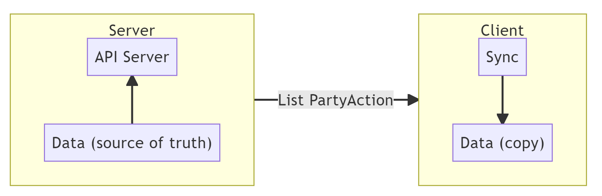
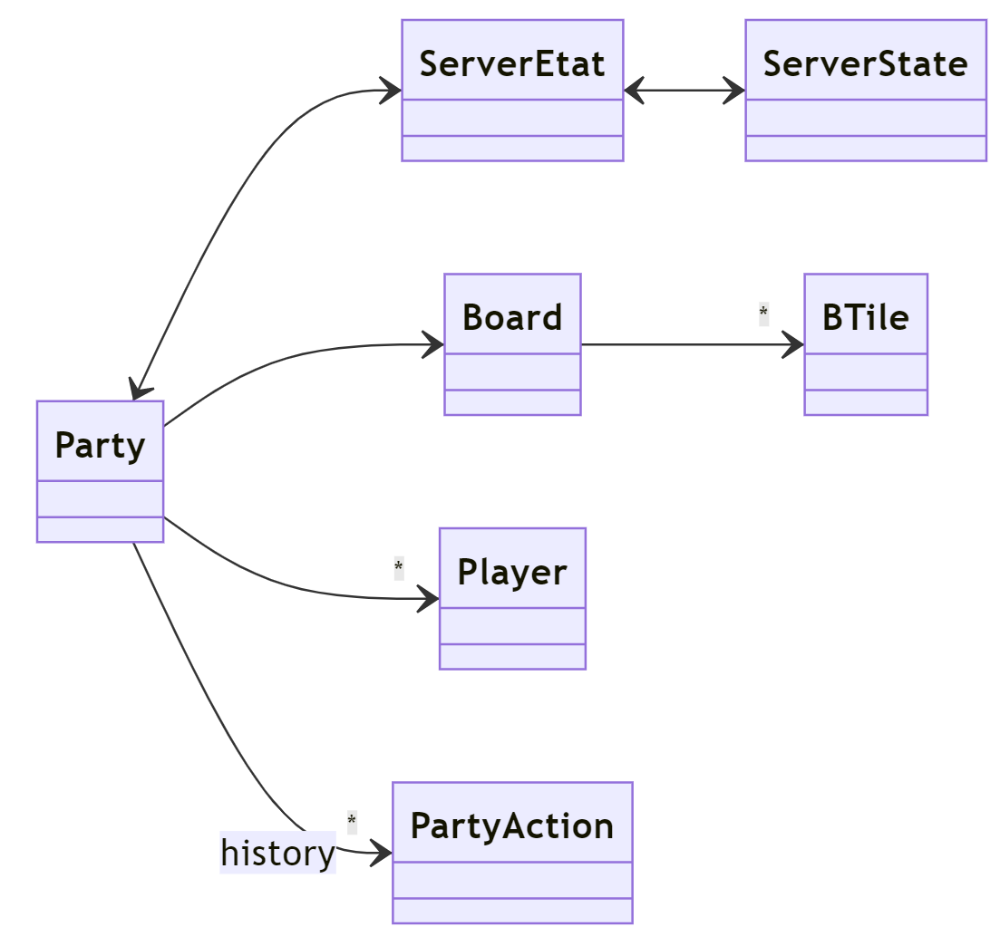
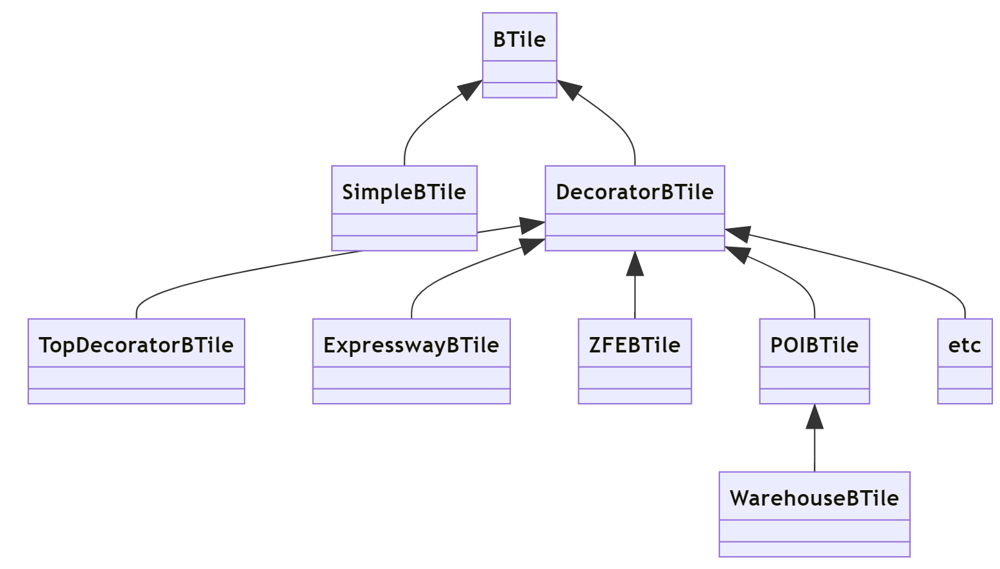
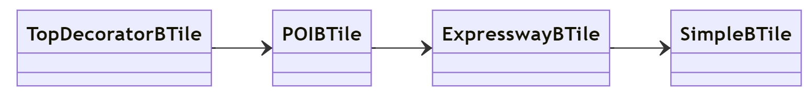
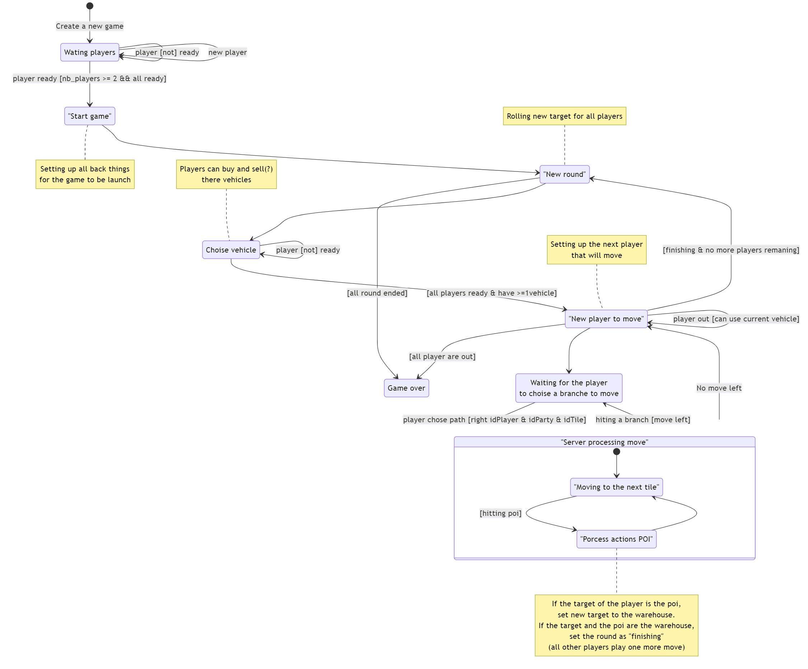

# Summary

Online multiplayer board game eco4 for Vectura System during Disrupt's Compus Nantes 2022-2023.

## Requirements

- Flutter ^3.3.9

## Installation

- Clone the repo
- Run `flutter pub get` to install dependencies

## Run the client server

- Run `flutter run` to start the app

## Run the API server

- Run with Dart the file ./lib/server/server.dart

## Code source author

- [Sviatoslav BESNARD](https://slavi.dev)

# Developer's guide

Hey there!

If you are assigned to maintain/develop this project, you are in the right place.
First of all, I am Sviatoslav BESNARD, an last year CS engineering student and
the original author of this project.

## What do you need to know?

There are a few things you need to know to maintain this project:

- Dart
- Flutter
- Some design patterns (decorator, repository, state, etc.)
- Serialization/Deserialization
- Your enthusiasm!

## The client vs the server

The client contain all the ui and the logic to interact with the server.
The server is a simple dart script that handle the game logic and the
communication with the client (via a simple API).

Some files are shared between the client and the server:

- lib/models/**.dart (except the party_repository.dart)
- server/api.dart

## Data, data and data

The most difficult when I developed this project is to handle the synchronization
between all the players and the server.
To do so, I used a simple but efficient: the server is THE SOURCE OF TRUTH.
He contains a stack of history of all the actions (cf `PartyAction`) that happened in the game.
When a player join the game, he receives the whole history and can replay it
to have the same state of data as the other players.
This data are mainly in the file `lib/models/board/party.dart`.

So, all modifications of the data must be done via this process to be correctly
synchronized!

### Structure: General

Below, you can find the _general_ class diagram of the data structures.
The `Party` and the `ServerEtat` are the most important ones.

### Structure: The Board and the tiles

The board contains all the board's tiles.

The tiles `BTile` follow the decorator pattern.
Each tile must is composed at least of a `SimpleBTile` and `TopDecoratorBTile`.
Each other decorator must be added in between them.

Example of a chained BTile that for a 'tile'

Moreover, each tile can be linked with other tiles to for the actual board.

### Structure: The ServerEtat

The `ServerEtat` follow the state pattern.
It contains the current state of the game and the logic to change it.
This state is not shared with the client (can be done but not implemented).

The API will call the right method of the `ServerEtat` to change the state of the game.

State diagram (an old one, so not up to date, just to give you an idea):

### Structure: PartyAction & MysteryCard

The `PartyAction` part is relatively simple.
Just a bunch of inheritance for each action
(maybe you can redefine some of them to be more useful for analyse the history).

A note for the class `EventAnimationAction`: This one is a bit special and encapsulate
an `EventAnimation` that need to be played on the client side.
For now is only to show the picked mystery card to everyone with `MysteryCardPickedEventAnimation`.

For the `MysteryCard`, it is the same. Just a bunch of inheritance for each card.

### Serialization

The serialization is done (some time) via the `json_serializable` package.
The main group of class that are serialized are mainly the `PartyAction`, `EventAnimation`, `MysteryCard`.

The most annoying part is the polymorphism. I go around it by using an attribute `type` like.
But, a posteriori, I discovered [dart_json_mapper](https://pub.dev/packages/dart_json_mapper) that
can handle polymorphism. So, if you want to refactor the serialization, you can use this package.

## OptionParty
I hastily implemented the option party.
So you can directly modify the file `/assets/image/option_party.json` to change the option of the party.

I not really sure if I will had each time to finish this feature and specially to handle
all the option in the `server_states.dart` file.

## Client side

On the other side, the client side is just kind of:

- Ping the server each X seconds to know if there is some new actions
- Update the PartyRepository with the new actions
- Each widget that listen to the PartyRepository will be updated
- Simple (no?)
- And some time, the client send request to the server
  (via [Retrofit](https://pub.dev/packages/retrofit), and handle by
  the server via [Alfred](https://pub.dev/packages/alfred)).

- (There are also an admin panel to restart the game)

## Security
This is a Proof of Concept.
So, you may have interest to add some security to the API. (like against spamming, etc.)

## Tests
No tests. (sadly)

## TODO
These are some things that you can do to improve this project:
- Add tests
- Add some serious security to the API
- Refactor the serialization
- Improve the OptionParty integration (and versatility)
- Add some more animations
- Add some more mystery cards
- Add some more boards
- Add some more *
- Improve the UI (maybe call a designer?)
- Get a bit of rest, you deserve it!
- Improve the server_state and consolidate the logic
- Add some more * (yes, again)

Good luck and have fun!
